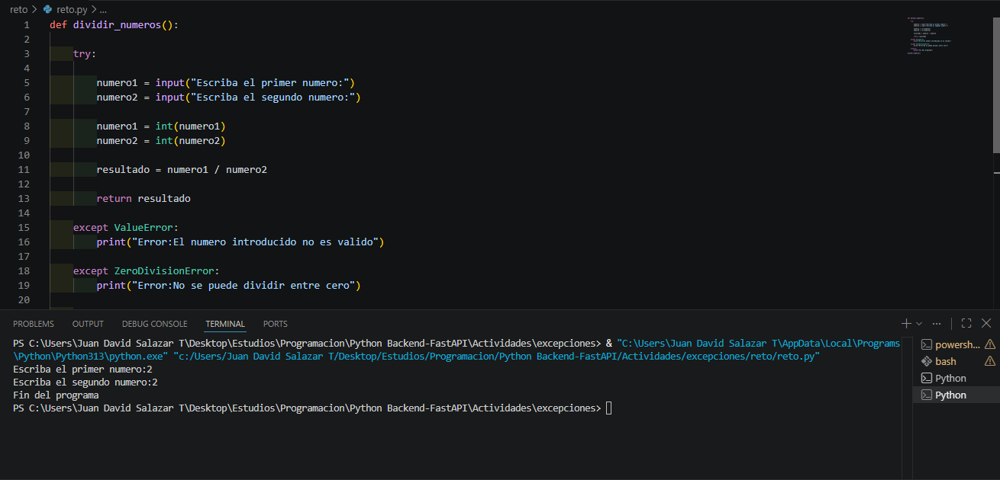
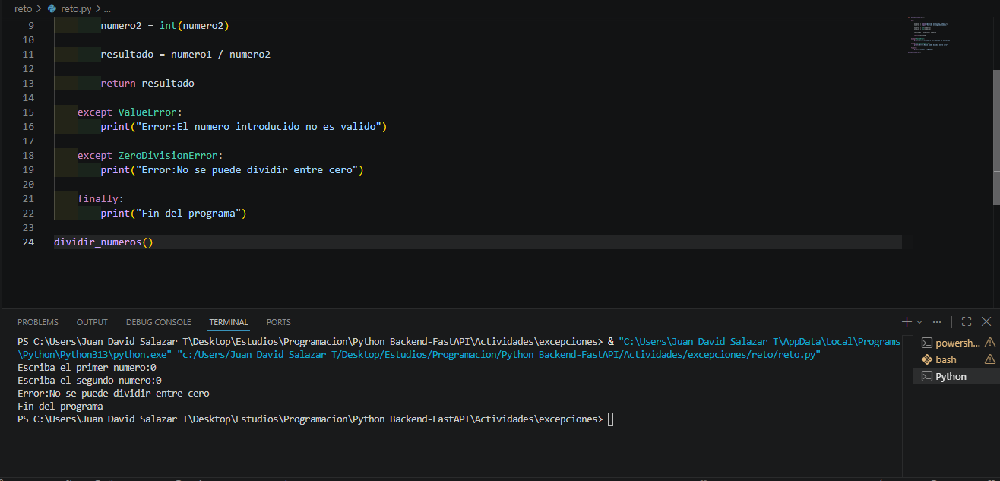

# excepciones

¿QUE SON LAS EXCEPCIONES?

Estas sirve para informar ya sea sobre un error en la ejecucion de un programa o un dato invalido iintroduciido por el usuario

DIFERENCIA ENTRE EXCEPT,ELSE Y FINALLY

-Except sirve para indicar un error en la ejecucion o un dato incorrecto.
 

-Else se ejecuta cuando un bloque de codigo no se cumple.

-Finally sirve para finalizar un bloque de codigo si ya termino el try.

CAPTURAS DE EJECUCION DEL RETO

REFLEXION PERSONAL SOBRE EL MANEJOR DE ERRORES

-El manejo de errores es fundamental para no generarle confusiones al usuario por un error del codigo y ademas para informar sobre lo que no se debe introducir en el programa ,de esta forma el usuario esta mas conectado con el programa.

==========================DATOS PERSONALES=======================================================

JUAN DAVID SALAZAR TORRES

FICHA :3169901

ANALISIS Y DESARROLLO DE SOFTWARE

PROFESOR

CARLOS NAVIA

SENA(CTMA)

